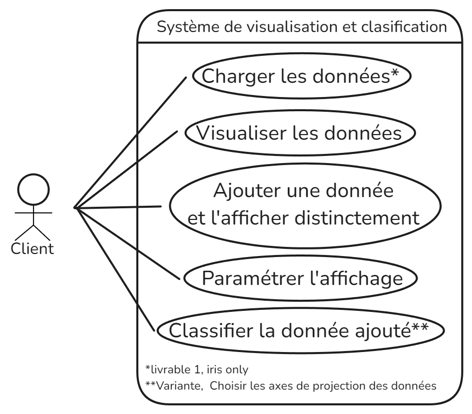

# TITRE

### Équipe H5
DE JESUS TEIXEIRA Lucas
RANDOUX Martin
WILFART Axel
LAMOUR Enzo

### Organisation du travail
*Expliquez en 2-3 lignes comment vous avez contribué au projet dans son ensemble et plus particulièrement au dossier d'analyse.*

**DE JESUS TEIXEIRA Lucas :**
-Contribution aux prototypes
-Contribution aux fiches descriptives 1 et 2

**RANDOUX Martin :**
-Contribution aux prototypes
-Contribution aux fiches descriptives 2

**WILFART Axel :**
-Forte Contribution aux prototypes
-Contribution au diagramme de cas d'utilisation

**LAMOUR Enzo :**
-Contribution aux prototypes
-Contribution aux fiches descriptives 3

## Diagramme de cas d'utilisation

### Fiches descriptives

*Mettre sur ce fichier à la version finale*
[Lien vers le fichier contenant les fiches descriptives](Fiche_Descriptive.md)

### Prototypes pour l'interface

[Lien vers les prototypes de l'interface](https://www.figma.com/design/UkQAUDAZHdLqFkSxj90ojb/SAE-H3?node-id=1-3371&t=kHTXrBXVV5nbXf4y-1)

*Inclure des prototypes de l'interface utilisateur pour ces fonctionnalités:*

- *Ajouter une donnée*
- *Classifier la donnée non classifiée*
- *Modifier les attributs pour l'affichage*

*Chaque prototype est constitué d'une suite d'écrans, ou d'une arborescence d'écrans si plusieurs chemins d'interaction sont possibles.*

*Pour les deux fonctionnalités dont on demande le prototype et la fiche descriptive, vous ferez le lien entre le prototype et la fiche descriptive. Plus précisément, pour chaque étape de la fiche descriptive, vous indiquerez à quel écran elle correspond. Vous pouvez par exemple mettre une légende sous l'écran, par ex. "Écran pour l'étape 3 de la fiche descriptive du UC Ajouter une donnée."*

*Les prototypes peuvent être en faible fidélité.*

*Les prototypes peuvent être dessinés à la main ou générés en utilisant un logiciel. Dans les deux cas, veillez à ce que les images soient lisibles et avec une bonne résolution (possibilité de zoomer pour lire le texte qui s'y trouve).*

## Diagramme de classes

*Inclure un diagramme de classes qui permet d'**implémenter toutes les fonctionnalités**.*

*Le diagramme de classes doit suivre le design pattern MVC, mais vous ne ferez pas figurer les classes de la vue. Il doit être clair quelles classes font partie du contrôleur (par exemple grâce à un nom de classe qui contient 'Controleur'); les classes restantes seront considérées faisant partie du modèle.*

*L'image du diagramme doit être de résolution suffisante permettant de zoomer et lire le texte qui y figure.*